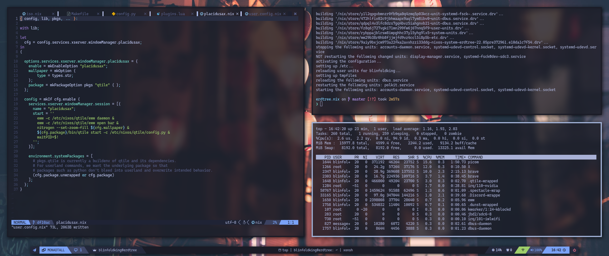

# Erdtree.nix



nixos distro/configuration for those who tired of reinstalling arch linux.

# Usage
you can use the configuration entirely or pick whatever module you need on your os (even on non-nixos).  
currently available modules:  
* [fortissax.nvim](https://github.com/BlinfoldKing/fortissax.nvim), nvim module
* [placidusax.py](https://github.com/BlinfoldKing/placidusax.py), custom desktop environment powered by qtile, rofi, and eww
* [lansseax.term](https://github.com/BlinfoldKing/lansseax.term), misc terminal and shell config

## Installation
### Makefile
1. install nixos, make sure your installation to include pkgs.git, and pkgs.gnumake.
2. clone and cd into repo with recursive flag
```bash
   $ git clone https://github.com/BlinfoldKing/erdtree.nix.git ~/erdtree.nix --recursive
   $ cd ~/erdtree.nix
```
3. run `make update-channel`
4. edit the `hardware-configuration.nix` or replace it with your current `hardware-configuration.nix`
5. edit `user.config.nix` based to your preferences
6. run `make rebuild`
7. restart your machine

### Flake
**TBA**

### Live ISO
**TBA**

## Contributing
feel free to report bugs, ideas, and discussion on the issue tab.
